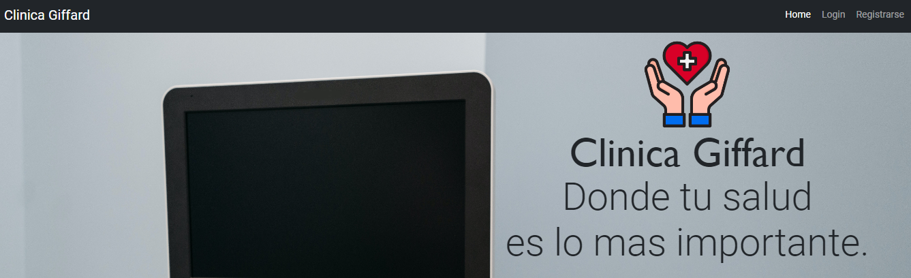
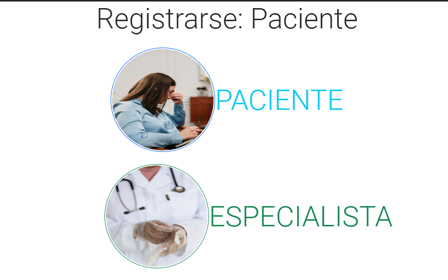
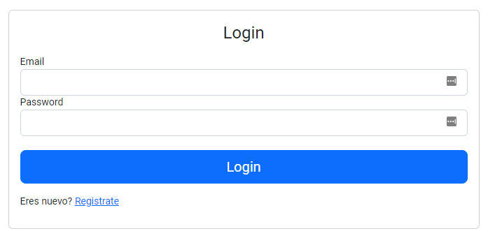
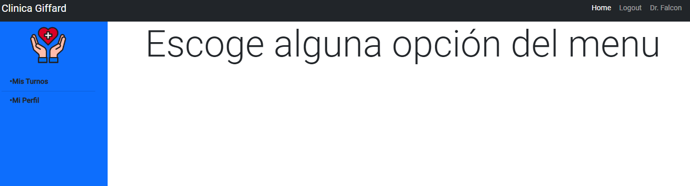

# Health-Angular 
 Proyecto laboratorio IV Angular
 Bienvenido al proyecto donde vas a interactuar con una clinica  en desarrollo
 Donde podras:
 * Generar una cuenta como: Administrador, especialista o paciente.
 * Ver tu perfil.
 * Crear turnos con nuestros especialistas expertos.
 * Gestionar los distintos turnos que puedas llegar a tener

 Y lo mejor de todo, completamente gratis!
 Visítanos, <https://clinica-giffard.web.app/bienvenida>
 

 ## Recorrido por la página web
 * **Inicio:** Encontraras nuestra página de bienvenida que será la siguiente.
 

 * **Registro:** En esta sección podras registrarte tanto como paciente como especialista.
 

 * **Login:** Cuando ya te hayas registrado y te hayan validado, ya sea como paciente (con verificación de email) 
 o como especialista (validado por el administrador), podras ingresar tu usuario para entrar al sistema.
 

 * **Menu:** Finalmente tendras acceso a tu menu donde dependiendo de tu tipo de usuario tendrás múltiples opciones en el sidebar.
 
 

 Powered by Alberto Giffard
